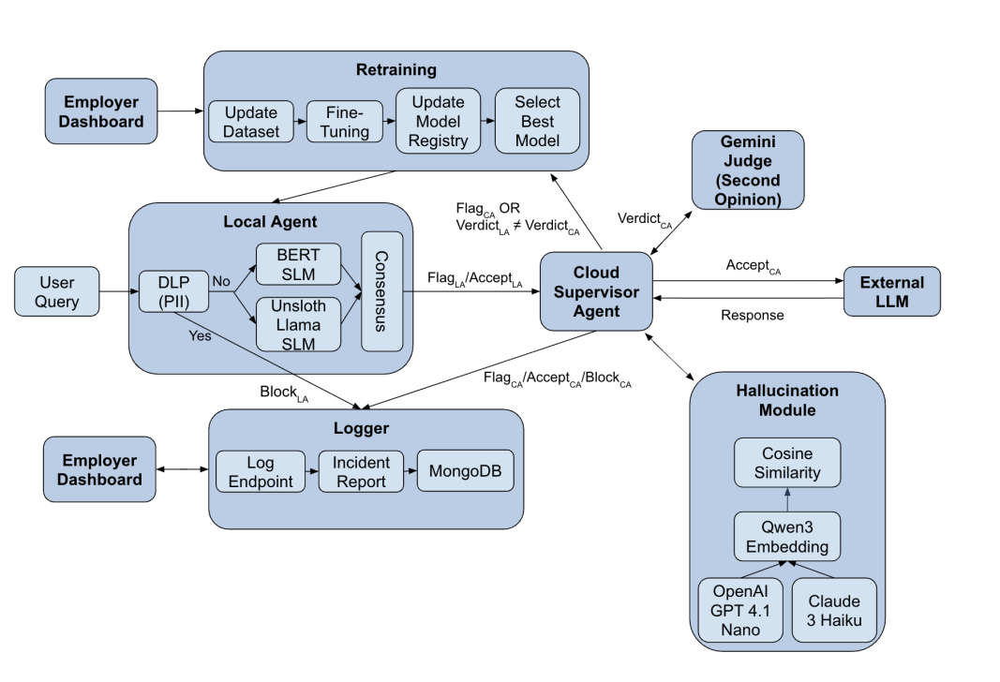

# Aiber Security Console Project

## Project Overview

The Aiber Security Console is a comprehensive application designed to monitor, manage, and analyze security-related data. It features a robust backend for data processing, agent management, and API services, coupled with a dynamic frontend for user interaction and data visualization. The system integrates a critical local agent and cloud-based agents, a database for persistent storage, and a module for periodically retraining local machine learning models.

## Architecture

The Security Console employs a sophisticated, multi-agent architecture designed for robust security monitoring and response. The core components and their interactions are as follows:

### User Query Processing

1.  **User Query:** Initiates the process, typically from a User Dashboard.
2.  **Data Loss Prevention (DLP) / Personally Identifiable Information (PII) Module:** Filters and processes the user query.
    *   If PII is detected, the query is blocked and sent to the Logger.
    *   If no PII is detected, the query proceeds to the Local Agent.
3.  **Local Agent:** Comprises multiple Small Language Models (SLMs) (e.g., BERT SLM, Unsloth Llama SLM) that process the query in parallel. A consensus mechanism determines the Local Agent's output (Flag_LA or Accept_LA).

### Cloud Supervisor Agent

The **Cloud Supervisor Agent** acts as the central orchestrator, receiving outputs from the Local Agent and coordinating with various external and internal modules:

-   **Gemini Judge (Second Opinion):** Provides an independent verdict (Verdict_CA) to the Cloud Supervisor Agent, to review the Local Agent's verdict and ultimately help the Local Agent evolve over time.
-   **External LLM:** The target LLM that the user aims to communicate with.
-   **Hallucination Module:** Assesses the truthfulness of the external LLMs responses using Qwen3 Embeddings, OpenAI GPT 4.1 Nano, and Claude 3 Haiku, employing Cosine Similarity for evaluation.
-   **Logger:** Logs all prompts, responses and intermediate actions from both Local and Cloud Agents for comprehensive logging.

### Retraining Module

This module ensures the continuous improvement of the system's small language models:

1.  **Employer Dashboard:** The employer can trigger the retraining process during log reviews.
2.  **Update Dataset:** New data is incorporated into the dataset.
3.  **Fine-Tuning:** Models are fine-tuned with the updated labeled dataset.
4.  **Update Model Registry:** The improved models are saved in the local registry.
5.  **Select Best Model:** The most performant model on the test set is selected for deployment, feeding back into the Local Agent or Cloud Supervisor Agent.

### Logger

The **Logger** is critical for auditing and incident management:

-   **Log Endpoint:** Records all significant events and agent decisions (Block_LA, Flag_CA, Accept_CA, Block_CA).
-   **Incident Report:** Generates detailed reports based on logged events.
-   **MongoDB:** Stores all log data for persistence and analysis.
-   **Employer Dashboard:** Provides visibility and control into logged incidents and reports.
